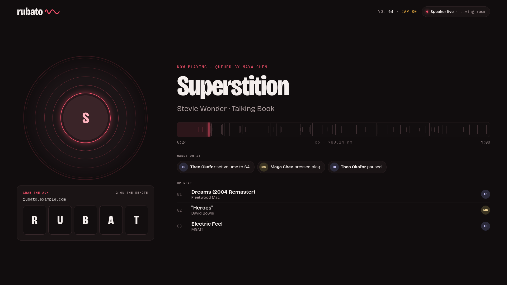
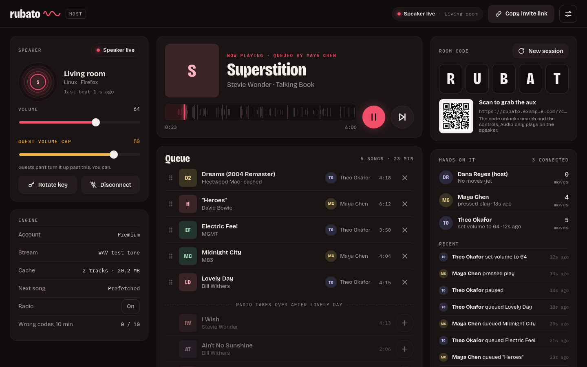
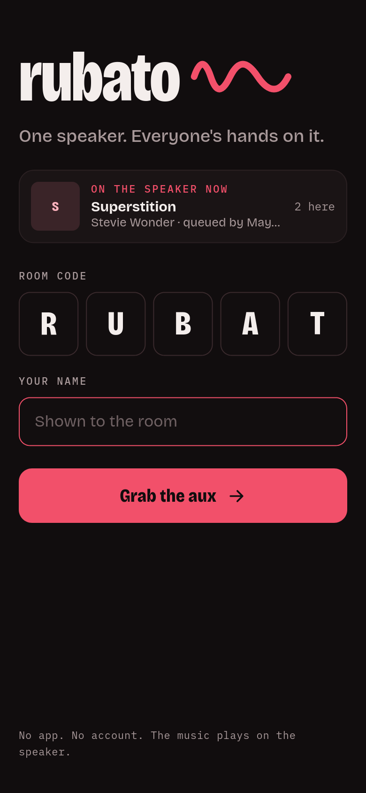
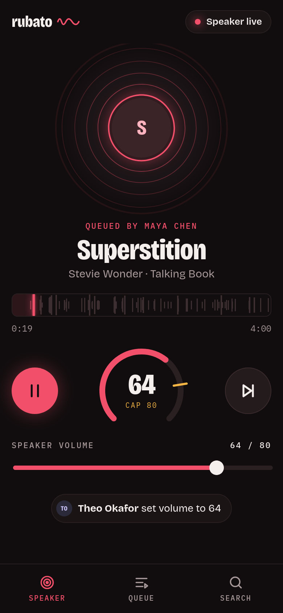
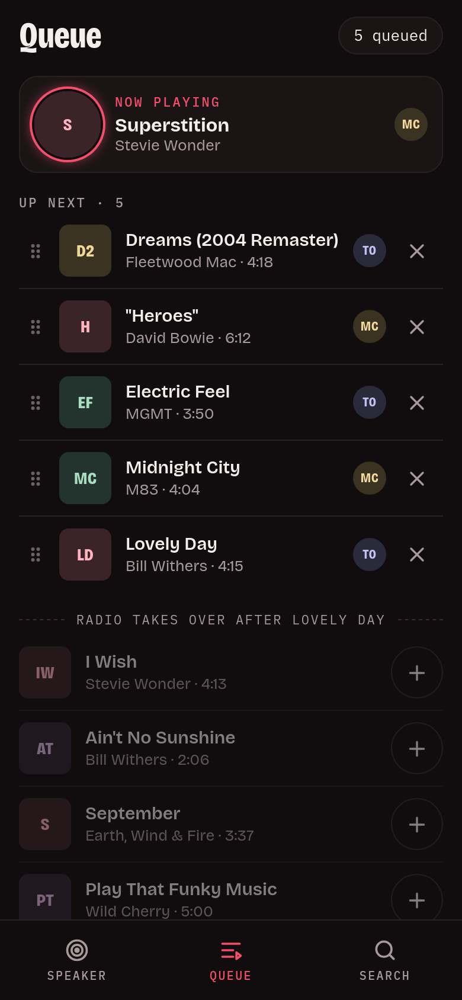
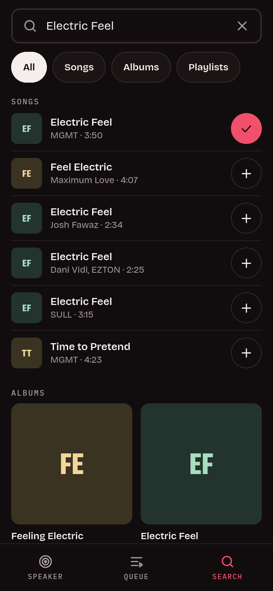

# rubato

**A self-hosted party remote for YouTube Music.** One device plays the music: a laptop on the stereo, an old phone on a Bluetooth speaker, a TV browser. Everyone else joins from their phone with a 5-letter code and gets a remote: search, queue, reorder, remove, play, pause, skip and volume. Every move is shown with the name of whoever made it. You run it on your own server, with your own YouTube Music account.



## Screenshots

The speaker display is above. The host dashboard:



The phone remote: join, the speaker remote, the queue, and search.

<p>
  
  
  
  
</p>

*Screenshots use test tones, made-up names and no album art; the room code and address are placeholders.*

> [!WARNING]
> **Unofficial APIs, your account, your risk.** rubato talks to YouTube Music through unofficial, reverse-engineered interfaces ([ytmusicapi](https://github.com/sigma67/ytmusicapi), [yt-dlp](https://github.com/yt-dlp/yt-dlp)) using **your own** signed-in session. It is not affiliated with or endorsed by Google or YouTube, and using it may violate [YouTube's Terms of Service](https://www.youtube.com/t/terms). Your account could be rate-limited or restricted. Use it at your own risk, and keep rooms to people you know.
>
> **Never share your cookies or your cookie file.** It is a login to your Google account.

## The name

*Rubato* is musical "stolen time": one performer pushes and pulls the tempo, and everyone else follows. Here the speaker keeps the time and everyone else has their hands on it.

It's also a sister to [cesura](https://github.com/acacesius/cesura). Rubidium (Rb, 37) sits directly above cesium in group 1, and both are atomic-clock elements. Cesium is named for its sky-blue spectral lines and rubidium for its deep red ones, so cesura is blue and rubato is red.

## What it is

- **One speaker, many remotes.** cesura plays the song on every phone in sync. rubato plays it on exactly one device, and the phones only control it. Nothing to keep in sync, and it works with a real sound system.
- **For guests:** join with the code and your name, then search songs, albums and playlists (or paste a YouTube link), queue, drag to reorder, remove, play/pause, skip, go back, seek, and set the speaker's volume up to the host's cap.
- **Hands on it:** every queue, remove, reorder, play, pause, skip, back, seek, clear and volume change is recorded with who did it. The speaker shows the last few, and the dashboard shows everyone connected with their last move.
- **For the host:** a dashboard with the speaker (live/offline, last heartbeat, volume, guest volume cap, rotate key, disconnect), the queue, autoplay radio, room code + QR, and engine health (account, stream quality, cache).
- **One container, no database, no accounts.** Everything lives in memory except `config/`. There's a first-run setup wizard, prebuilt images for amd64 and arm64, and a weekly rebuild with the latest yt-dlp.

## Quick start

You need Docker with the Compose plugin, and a YouTube Music account. Premium gets 256k AAC; without it, 128k.

```sh
mkdir -p rubato/config rubato/cache && cd rubato
curl -fsSLO https://raw.githubusercontent.com/acacesius/rubato/main/docker-compose.yml
docker compose up -d && docker compose logs rubato
```

The logs show a box with your **one-time setup token**:

```
========================================================================
  rubato is not set up yet.

  Open  /setup  in your browser and enter this one-time setup token:

      pX3...Qa9

  Only someone with this token can configure this server. It stops
  working as soon as setup is finished.
========================================================================
```

Open `http://127.0.0.1:8766/setup` on the same machine, or through the address you expose it on (see [Exposing it](#exposing-it)). Then paste the token. Lost it? Run `docker compose logs rubato` again: it's printed on every start until setup is done.

> Create `config/` and `cache/` **before** the first `up` (the first command above does). If Docker creates them, they're owned by root, and rubato will print how to fix `config/`.

## The setup wizard

The setup token keeps strangers from claiming a fresh instance: nothing can be configured without it, and it stops working once setup is finished.

1. **You.** Your name (the room sees your moves as *name (host)*) and the **host key**, generated and shown **once**. Save it in a password manager; it opens the dashboard. `HOST_KEY` in `.env` overrides it.
2. **The speaker.** The **speaker key**, shown once as a speaker link: `https://your.address/speaker#k=…`. Open that link on the device that plays. `SPEAKER_KEY` in `.env` overrides it.
3. **Public address.** The URL guests and the speaker will use, for the invite link, QR code and speaker link. It must be `https://` unless it's localhost. `PUBLIC_URL` in `.env` overrides it.
4. **Link YouTube Music.** Upload a cookies.txt export (guide below). rubato checks it against YouTube right away and tells you what it found, e.g. *"Premium detected · 256k AAC"*, or what to fix. You can skip this step, but playback stays off until you link it.
5. **Done.** You land on the host dashboard at `/host`.

## The speaker

Open the speaker link on the device that will play, and tap **Tap to start speaker** once (browsers don't let a page play audio without a tap). Then leave it on screen: it shows what's playing, who queued it, the last few moves, what's up next, and the room code so people nearby can join.

- **Only one speaker at a time.** Opening the speaker link on another device takes over; the old one stops and says it was taken over.
- **The speaker keeps the time.** It sends a heartbeat every second, and the next song starts only when the speaker says the current one ended. Phones show progress from that heartbeat.
- **If it goes quiet** (closed, crashed, lost Wi-Fi), everyone sees **Speaker offline** within 5 seconds and the room is paused. When it comes back, it picks up where it was.
- **The key is only for the speaker.** The key in the link never reaches the server's logs (it's after the `#`). The page trades it for a per-session token, and only that token can fetch audio. A takeover, a disconnect or **Rotate key** on the dashboard ends the token. The room code alone can't fetch audio.
- **Volume** is the speaker's volume, set from any phone and capped by the host's **Guest volume cap**. The host can go above the cap. It also works when the speaker is an iPhone, because rubato sets it through Web Audio.

## The remote

- **Transport:** back · play · skip, for everyone in the room.
- **Seek:** click or drag the spectral bar, or focus it and use the arrow keys (5 s; Page Up/Down 30 s). Nothing is sent while you drag; one jump on release. The speaker jumps there and the room sees who did it.
- **Back:** restarts the song once it has played 3 seconds, otherwise goes to the previous one, even after a skip (the server keeps the last 30). The song you left goes back to the top of the queue.
- **Drag to reorder:** the grip on a queue row, by mouse, touch or arrow keys. If someone else moved the queue first, your drag is refused and the list redraws.
- **Like** (host only): the heart on the dashboard adds the song to your YouTube Music liked songs, which feeds your radio; press again to un-like. If YouTube refuses, you see the error and nothing changes.
- **Clear** (host only, on the queue card): removes every upcoming song after asking. The current song, the play history and the radio picks stay.
- **Themes:** the palette button on the remote and the speaker, or Settings → *Theme* on the dashboard: Rubidium (default), Sakura, Night sakura, Matcha, Lavender, Ocean, Sunset, Paper and Mono. Each person's pick is kept in their own browser.
- **Artist panel:** on a wide screen (1100 px and up), the remote shows the current artist's image, name and a short bio beside it. From YouTube Music, cached per artist for a day. Phones never load it.

## Linking YouTube Music

rubato streams through your own YouTube Music session, as a `cookies.txt` exported from a **private window**. A normal window keeps using and rotating the same cookies, which breaks the export quickly. A private window that you close right after exporting doesn't.

1. **Install an open-source exporter:**
   - **[Get cookies.txt LOCALLY](https://github.com/kairi003/Get-cookies.txt-LOCALLY)**: [Chrome / Edge / Brave](https://chromewebstore.google.com/detail/get-cookiestxt-locally/cclelndahbckbenkjhflpdbgdldlbecc), [Firefox](https://addons.mozilla.org/firefox/addon/get-cookies-txt-locally/)
   - or, on Firefox, **[cookies.txt](https://github.com/hrdl-github/cookies-txt)**: [Firefox Add-ons](https://addons.mozilla.org/firefox/addon/cookies-txt/)

   Avoid **"Get cookies.txt"** (without "LOCALLY"). It was reported as malware and removed from the Chrome Web Store.
2. **Allow it in private windows.** In Chrome: extension *Details* → **Allow in Incognito**. In Firefox: *Manage extension* → **Run in Private Windows** → Allow.
3. **Open a private (incognito) window** and sign in at [music.youtube.com](https://music.youtube.com).
4. **In the same tab, open `https://www.youtube.com/robots.txt`.** It's a plain page, so YouTube can't rotate your cookies while you export.
5. **Export cookies.txt** from the extension, in Netscape format. Extra sites in the file are fine: rubato keeps only YouTube and Google cookies and drops the rest.
6. **Close the private window. Don't log out**; logging out ends the session you just exported.
7. **Upload the file** in the wizard, or later from the host dashboard (**Relink YouTube**). Then delete your downloaded copy.

What rubato does with the file:
- It accepts only a Netscape cookies.txt up to 256 KB that contains a signed-in session.
- It stores the file as `config/cookies.txt`, readable only by the app (mode 600).
- It never logs, displays or returns cookie values.
- When YouTube rotates cookies during normal use, rubato saves the refreshed ones, but only if the session is still signed in.

The link check reports three things:
- **Account:** YouTube Music confirms the session is signed in.
- **256k AAC:** YouTube offers format 141 for a test song (`PROBE_VIDEO_ID`, default: Queen – *Bohemian Rhapsody*).
- **Premium:** inferred from 256k AAC being available. YouTube has no direct "Premium" flag.

When the link stops working (YouTube's bot check, or the session got signed out), the dashboard shows **YouTube link expired** with a **Relink YouTube** button. Relinking is the same upload and check as in setup.

## Configuration

Put these in a `.env` file next to `docker-compose.yml` (copy [`.env.example`](.env.example)). All are optional.

| Variable | Default | What it does |
|---|---|---|
| `PORT` | `8766` | Port published on the host. |
| `BIND` | `127.0.0.1` | Interface the port is published on. Docker bypasses host firewalls such as UFW, so this is your real exposure control. Keep `127.0.0.1` and put a reverse proxy or tunnel in front. |
| `PUBLIC_URL` | *(from setup)* | Base URL for the invite link, QR code and speaker link. Overrides the wizard's value. |
| `ROOT_PATH` | | Only when a proxy serves rubato under a path and passes that path through. Proxies that strip it need nothing (see [Under a path](#under-a-path)). |
| `TRUSTED_PROXY_CIDR` | `172.16.0.0/12` | `X-Forwarded-For` is trusted only from this network (your proxy, as the container sees it). Rate limits and lockouts are per client IP. |
| `HOST_KEY` | *(from setup)* | Host dashboard key. Overrides the wizard's key. |
| `SPEAKER_KEY` | *(from setup)* | Speaker key. Overrides the wizard's key, and disables Rotate key on the dashboard. |
| `PROBE_VIDEO_ID` | `BSTsnWoslP4` | Song used by the link check. Change it if that one is unavailable where you are. |
| `DOWNLOAD_RATE` | `2` | Speed cap for fetching songs from YouTube, in MB/s (`2` ≈ 16 Mbit/s; `0` = no cap). Songs download one at a time (the current one, then the next), so one download can't fill your link. |
| `ART_CACHE_MB` | `300` | Size of the artwork cache in `./cache` (album art, artist images). Phones load artwork from rubato, not from Google; the oldest files go first. |
| `RUBATO_UID` / `RUBATO_GID` | `1000` | User the container runs as. It must own `./config` and `./cache`. |
| `MEM_LIMIT` | `1g` | Container memory limit. Songs are held in RAM: the current one, the next, and a couple of recent ones. |
| `YTM_CLIENT_ID` / `YTM_CLIENT_SECRET` | | Only for optional ytmusicapi OAuth (personalised radio). Not needed. |

The compose file runs the container hardened: non-root, read-only root filesystem (only `./config` and a `/tmp` tmpfs are writable), all capabilities dropped, `no-new-privileges`, and memory and process limits. Don't mount the Docker socket into it.

## Exposing it

rubato listens on `127.0.0.1:8766`. Put something in front that terminates HTTPS and passes websockets, then set the public address in setup (or `PUBLIC_URL`).

**Reverse proxy** on the same machine, e.g. Caddy:

```
rubato.example.com {
    reverse_proxy 127.0.0.1:8766
}
```

If your proxy runs in Docker on its own network, set `TRUSTED_PROXY_CIDR` to that network.

### Under a path

rubato can share a host and port with something else, e.g. `https://example.com/rubato`. Every page works out its own prefix, so nothing needs configuring when the proxy strips the path before passing the request on (Tailscale `serve --set-path`, Caddy `handle_path`, nginx `proxy_pass http://127.0.0.1:8766/;` with the trailing slash). If your proxy passes the path through unchanged, set `ROOT_PATH=/rubato`. Either way, enter the full address, path included, as the public address in setup.

> [!NOTE]
> **Sharing a hostname and port shares a browser origin.** With path-based routing, rubato and the other app are the same origin to the browser, so each can read what the other keeps in local storage, including rubato's host and speaker keys on the devices that use them. Only put rubato next to apps you trust, and give rubato its own port or hostname if that matters to you.

**Tunnel** (Cloudflare Tunnel, ngrok and similar): point it at `http://127.0.0.1:8766` and use the tunnel's HTTPS address as the public URL.

**Tailscale.** `serve` shares it inside your tailnet; `funnel` makes it public (Funnel allows ports 443, 8443 and 10000):

```sh
tailscale serve status --json > serve-backup.json                 # save what's there first
sudo tailscale serve  --bg --https=8766 http://127.0.0.1:8766     # tailnet only
sudo tailscale funnel --bg --https=10000 http://127.0.0.1:8766    # public internet
```

All three Funnel ports taken? Share one under a path instead (see [Under a path](#under-a-path)); the app already on that port keeps `/`:

```sh
sudo tailscale funnel --bg --https=8443 --set-path=/rubato http://127.0.0.1:8766
```

> [!CAUTION]
> **Never run `tailscale serve --https=<port> off`** to remove an entry. On some versions it wipes **all** serve and Funnel configuration on the machine, not just that port. Keep the backup from above so you can recreate anything that gets lost.

While exposed:
- guests need the current room code and a name for everything except audio, and audio needs the active speaker's token;
- the dashboard needs the host key, and the speaker page needs the speaker key;
- each IP gets 10 wrong codes or keys per 10 minutes before a lockout;
- adds and other controls are rate-limited.

Press **New session** after a party to rotate the code. The speaker stays connected.

## Updating

```sh
docker compose pull && docker compose up -d
```

- **`:latest`** is rebuilt **weekly** with the newest yt-dlp, yt-dlp-ejs and ytmusicapi, and only published if its smoke tests pass. YouTube changes break these libraries regularly, so pulling is usually the fix.
- **Versioned tags** (`:0.1.0`, …) are published for each release, if you want to pin one.
- **Source installs** (`docker-compose.dev.yml`): run `./update.sh`. It bumps those three libraries to their latest releases, rebuilds, restarts and runs the self-test.

To check a running install: `docker compose exec rubato python -m app.selftest`

## Troubleshooting

| Symptom | Fix |
|---|---|
| **"YouTube link expired"** on the dashboard | Export fresh cookies from a *new* private window (guide above) and use **Relink YouTube**. |
| **Bot check**: "Sign in to confirm you're not a bot" in the logs, or the link check says so | Same as above. Datacenter/VPS IPs get this far more often than home connections. |
| Everything skips, `could not load` in the logs, `Requested format is not available` | Update: `docker compose pull && docker compose up -d` (source installs: `./update.sh`). |
| The speaker says **Waiting for a tap** | Tap the play button on the speaker. Browsers need one tap per page load before they play audio. |
| **Speaker offline** but the device is on | It stopped sending heartbeats: the screen locked, the tab was put to sleep, or Wi-Fi dropped. Keep the speaker page in front with the screen on (it holds a wake lock over HTTPS). |
| The speaker says **Taken over** | Someone opened the speaker link on another device. Tap **Take it back**, or **Rotate key** on the dashboard if the link leaked. |
| Lost the speaker link | **Rotate key** on the dashboard shows a new one. |
| Link check: "Signed in · no Premium detected · 128k AAC" | Works, but at 128k. Export from the account that has Premium. |
| "config is not writable" box in the logs | `sudo chown -R 1000:1000 ./config`, or set `RUBATO_UID`/`RUBATO_GID` to the owner of `./config`. |
| Lost the setup token | `docker compose logs rubato`. It's reprinted on every start until setup finishes. |
| Lost the host key | Stop the container, delete `config/host_key` and `config/setup.json`, and start again. A new setup token is printed; your cookies stay linked. |

## Known limits

- **The speaker needs to stay awake.** A phone speaker with its screen locked may stop sending heartbeats or stop between songs. Plug it in and keep the page on screen.
- **Open controls.** Anyone with the room code can queue, remove, reorder, pause, skip and change the volume (up to the cap). The feed shows who did what.
- **Names aren't accounts.** A name is whatever a guest typed when joining.
- **One room per instance.** State is in memory: a restart ends the session and changes the code.
- **Unofficial APIs.** It breaks when YouTube changes things; update, and relink when asked.

## Development

```sh
git clone https://github.com/acacesius/rubato && cd rubato
mkdir -p config cache
docker compose -f docker-compose.dev.yml up -d --build
python3 tests/smoke.py --image rubato:dev     # the same smoke test CI runs before publishing
```

- **Server:** FastAPI + uvicorn in `app/`. It owns the queue and arbitrates every command; it never ends a song on its own.
- **Frontend:** plain HTML/JS in `static/`, with no build step. `/` is the phone remote, `/speaker` the player, `/host` the dashboard.
- **Streams:** resolved once by yt-dlp (running YouTube's player JS in Deno), held in memory, and served to the speaker with HTTP Range support.
- **Without a YouTube account:** `tests/fakeserver.py` runs the app with generated test tones in place of YouTube audio (search and radio stay real), for trying the speaker flow end to end. See the docstring.

## License

MIT. See [LICENSE](LICENSE). The bundled fonts, Bricolage Grotesque and IBM Plex Mono, are under the SIL Open Font License; see `static/fonts/`.
